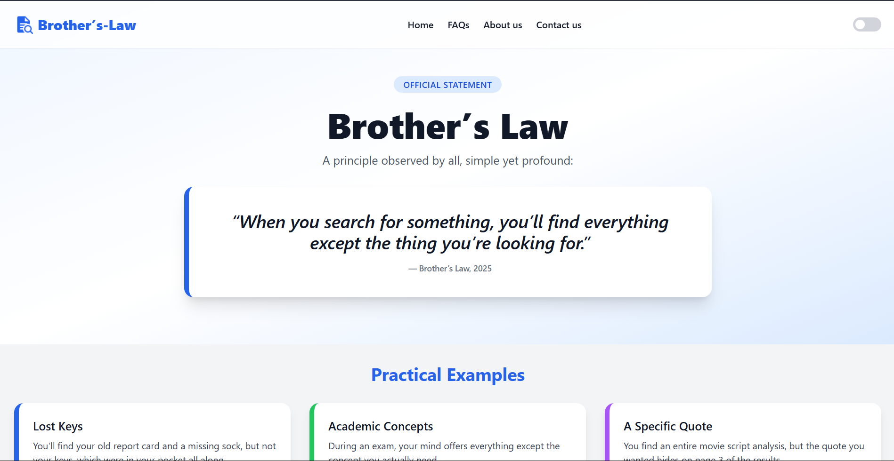
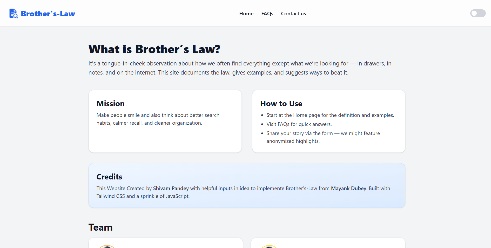
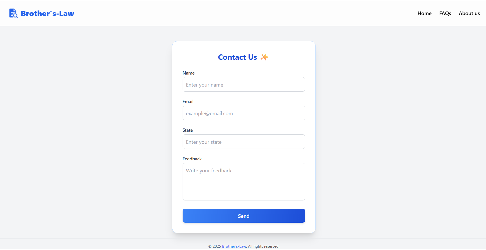
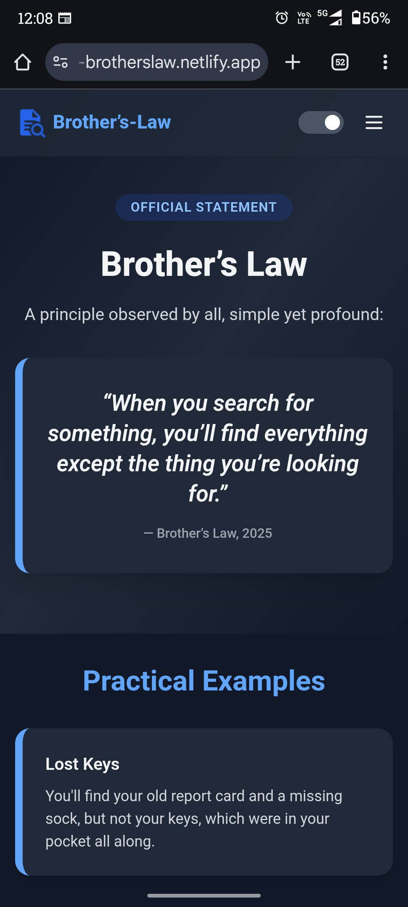
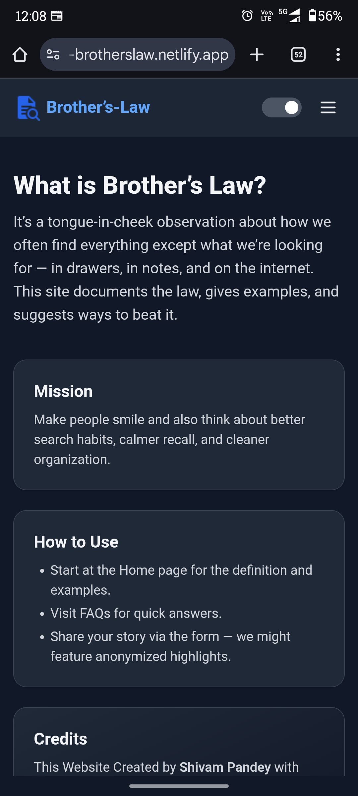

# Brother’s Law 🌐

> **“When you search for something, you’ll find everything except the thing you’re looking for.” — Brother’s Law, 2025**

Brother’s Law is a fun yet insightful web project that explains a universal memory phenomenon: how our brains often recall everything except what we actually need.  
The site shares examples, the reasoning behind it, and solutions — while also showcasing other famous “laws” like Murphy’s Law, Kidlin’s Law, and more.

---
## 🌍 Live Demo

🔗 **[View Demo](https://68b8cb7dfbc8f8e1b0fea9f2--brotherslaw.netlify.app/)**  

## ✨ Features

---

- **Official Statement** – Defines Brother’s Law in a relatable way.
- **Practical Examples** – Lost keys, forgotten exam concepts, elusive quotes, etc.
- **Reason & Solution** – Explains proactive interference and how to overcome it.
- **About Section** – Introduces the creators: Shivam Pandey & Mayank Dubey.
- **Universal Laws** – Cards highlighting other well-known life principles.
- **Dark/Light Theme Toggle** – With state saved in `localStorage`.
- **Responsive Navigation** – Mobile and desktop menu support.
- **Contact Form** – Built with [EmailJS](https://www.emailjs.com/) to collect feedback.
- **Smooth UX** – Includes loading skeleton, animations, and TailwindCSS styling.

---

## 🖼️ Screenshots(PC)

|     Home     |    About us  |  Contact us  |
|--------------|--------------|--------------|

  
  
  

 

## 🖼️ Screenshots(Smart Phone)

|     Home     |    About us  |  Contact us  |
|--------------|--------------|--------------|

  
  
  

---

## 🛠️ Tech Stack

- **Frontend:** HTML5, CSS3 (TailwindCSS), JavaScript (Vanilla)
- **Styling:** TailwindCSS with dark mode support
- **Interactivity:** JavaScript (`index.js`) for theme toggle, mobile nav, and FAQ accordion
- **Forms & Email:** EmailJS integration (`contactUs.html`)
- **Hosting:** Netlify

---

## 📂 Project Structure

├── index.html # Homepage (law statement, examples, about, universal laws)
 
├── contactUs.html # Contact page with EmailJS form
 
├── index.js # Theme toggle, nav toggle, FAQ accordion, skeleton loader
 
├── about.html # (Referenced, not provided here)
 
├── FAQs.html # (Referenced, not provided here)
 
├── /Image/
│ ├── fav.icon # Site favicon/logo
|  
│ ├── Shivam.png # Owner Shivam’s profile picture
|   
│ ├── mayank.png # Owner Mayank’s profile picture
|  
│ ├── ...icons # Social and contact icons
 
├── /ScreenShots/
│ ├── PcHome.png # ScreenShots of PC home webpage
|  
│ ├── PcAboutus.png # ScreenShots of PC About us webpage
|   
│ ├── PcAboutus.png # ScreenShots of PC About us webpage
|  
│ ├── ...icons # Social and contact icons

---
